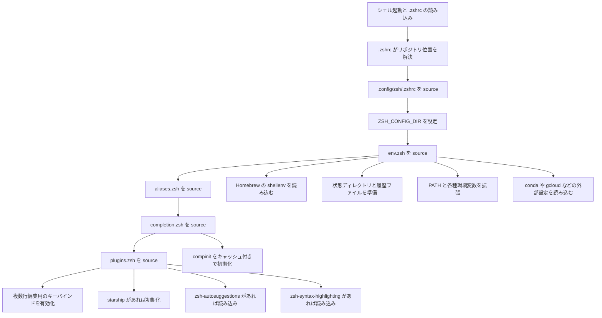

# Zsh 設定の概要

このドキュメントでは、このリポジトリにある Zsh 設定がどう整理されているか、各ファイルが何を担当しているか、どこを編集すればよいかを説明します。

## 全体像

このリポジトリでは、ルートの `.zshrc` は小さな入口として使われています。  
実際の設定本体は `.config/zsh/` 以下にあり、役割ごとに分割されています。

- 環境変数と `PATH`
- エイリアス
- 補完
- プラグインとプロンプト

この分け方により、起動順を追いやすくなり、新しい設定をどこに置くべきかも判断しやすくなっています。

## 起動フロー

## ファイルごとの役割

### `.zshrc`

ルートにある [`.zshrc`](/Users/KokiAoyagi/Documents/repos/dotfiles/.zshrc) は薄いラッパーです。  
自分自身の位置を解決し、リポジトリ内の `.config/zsh/.zshrc` を見つけて `source` します。

この構成により、標準的な Zsh の入口ファイル名を保ちつつ、実際の設定を `.config/` 配下に整理できます。

### `.config/zsh/.zshrc`

[`.config/zsh/.zshrc`](/Users/KokiAoyagi/Documents/repos/dotfiles/.config/zsh/.zshrc) は中心となるローダーです。  
`ZSH_CONFIG_DIR` を定義したあと、次の順番で各モジュールを読み込みます。

1. `env.zsh`
2. `aliases.zsh`
3. `completion.zsh`
4. `plugins.zsh`

この順番には意味があります。

- 環境変数や `PATH` を先に整える
- そのあとでエイリアスを定義する
- 補完を初期化する
- 最後にプロンプトや対話的なプラグインを読み込む

### `.config/zsh/homebrew.zsh`

[`.config/zsh/homebrew.zsh`](/Users/KokiAoyagi/Documents/repos/dotfiles/.config/zsh/homebrew.zsh) は、一般的な Homebrew のインストール先を順に確認し、`brew shellenv` を実行します。

後続の設定が Homebrew 経由のツールに依存していても動くように、シェル環境を先に整える役割を持っています。

### `.config/zsh/env.zsh`

[`.config/zsh/env.zsh`](/Users/KokiAoyagi/Documents/repos/dotfiles/.config/zsh/env.zsh) は環境設定を担当します。

現在は主に次のことを行っています。

- `homebrew.zsh` を読み込む
- `ZSH_STATE_DIR` を定義する
- シェル履歴を XDG 風の state ディレクトリに保存する
- ローカルバイナリ、Go、PostgreSQL、pnpm など向けに `PATH` を拡張する
- `CPLUS_INCLUDE_PATH` を拡張する
- `~/.local/bin/env` から追加の環境設定を読み込む
- conda が利用可能なら初期化する
- Google Cloud SDK の path と completion を読み込む

ツールを入れたのにコマンドが見つからない時や、シェル全体で共有したい環境変数を追加したい時は、このファイルを編集するのが基本です。

### `.config/zsh/aliases.zsh`

[`.config/zsh/aliases.zsh`](/Users/KokiAoyagi/Documents/repos/dotfiles/.config/zsh/aliases.zsh) はエイリアスを定義する場所です。

内容は大きく 2 つに分かれています。

- 競技プログラミングや簡易テスト向けのショートカット
- `nvim` や `tmux` のような日常コマンドの短縮名

引数付きの複雑な処理ではなく、短いコマンド名を定義したい時にここへ追加するのが自然です。

### `.config/zsh/completion.zsh`

[`.config/zsh/completion.zsh`](/Users/KokiAoyagi/Documents/repos/dotfiles/.config/zsh/completion.zsh) は補完の初期化を担当します。

行っていることは次のとおりです。

- `compinit` を autoload する
- XDG 風のキャッシュディレクトリを作る
- `.zcompdump` をそのキャッシュディレクトリに置く

これにより、補完用のキャッシュがリポジトリ本体やホームディレクトリ直下に散らばりにくくなります。

### `.config/zsh/plugins.zsh`

[`.config/zsh/plugins.zsh`](/Users/KokiAoyagi/Documents/repos/dotfiles/.config/zsh/plugins.zsh) は、対話的なシェル挙動と任意プラグインの読み込みを担当します。

現在含まれているのは次のような内容です。

- Shift+Enter で複数行編集しやすくするキーバインド
- `starship` がある場合のプロンプト初期化
- Homebrew の formula 位置を調べる補助関数
- `zsh-autosuggestions` の条件付き読み込み
- `zsh-syntax-highlighting` の条件付き読み込み

このファイルは、対象ツールが存在しなくても起動失敗しないように、防御的に書かれています。

## 機能ごとの見方

### 環境変数とツール検出

環境準備の中心は `env.zsh` と `homebrew.zsh` です。  
`PATH` の組み立てや、conda、gcloud など外部ツールチェーンとの接続はここで行われます。

### 対話的な使い勝手

対話的な改善は `plugins.zsh` にまとまっています。  
プロンプト、シンタックスハイライト、自動補完候補、キーバインドのように、シェル起動後の操作感に関わる設定をここに寄せています。

### 補完とキャッシュ

補完は `completion.zsh` に切り出されています。  
そのため、起動時の問題を調べる時に、補完由来なのかプラグイン由来なのかを分けて考えやすくなっています。

### ショートカット

エイリアスは `aliases.zsh` に分離されています。  
環境設定やプラグイン設定と混ざらないので、普段使う短縮コマンドを見返しやすい構成です。

## 何をどこで変えるか

変更したい内容ごとに、編集先は次のように考えると分かりやすいです。

| 変更したい内容 | 編集先 |
| --- | --- |
| ルートから設定本体へ入る導線 | `.zshrc` |
| 共通の環境変数や `PATH` | `.config/zsh/env.zsh` |
| Homebrew の初期化 | `.config/zsh/homebrew.zsh` |
| エイリアスや短縮コマンド | `.config/zsh/aliases.zsh` |
| 補完設定 | `.config/zsh/completion.zsh` |
| プロンプト、キーバインド、任意プラグイン | `.config/zsh/plugins.zsh` |

## 外部依存

一部の挙動は、マシン上にある外部ツールに依存します。

- Homebrew
- starship
- zsh-autosuggestions
- zsh-syntax-highlighting
- conda
- Google Cloud SDK

これらは存在する時だけ読み込まれるように書かれています。  
そのため、導入済みツールの違う複数マシンでも比較的持ち運びしやすい構成です。

## まとめ

この Zsh 設定は、意図的に小さく、役割ごとに分けて構成されています。

- ルートの `.zshrc` は入口だけを担当する
- `.config/zsh/.zshrc` が読み込み順を決める
- 各ファイルは 1 つの関心ごとを持つ
- 任意ツールは存在する時だけ防御的に読み込む

今後メンテナンスする時の基本方針は単純です。  
設定を 1 つの大きなスクリプトに増やすのではなく、その設定が属する責務のファイルへ追加していくのがよいです。
